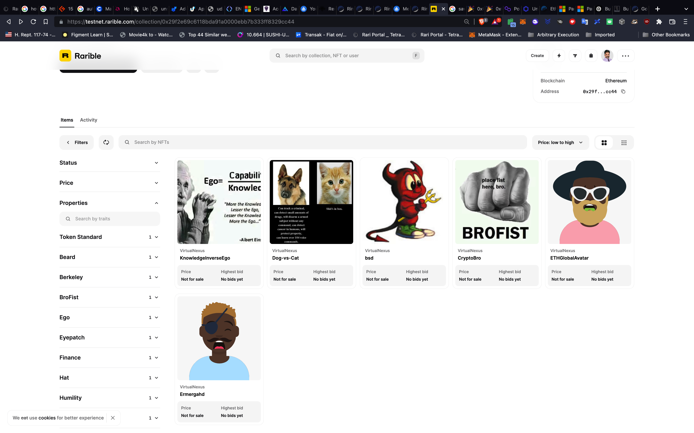

# Develop and Deploy NFT Smart Contract and Mint NFT

This project creates and NFT Collection and Mints one.

## Create and Deploy
```
1. Use OpenZeppelin Wizard to create ERC721 Solidity Contract
2. Mintable, Autoincrement, Enumerable, URIStorage, Ownable
3. Create functions for minting and emit events
4. Deploy vn-nft.sol Rinkeby using Remix and save contract address (0x29F2E69c6118Bda91A0000eBB7b333fF8329cc44)
```

## Mint
```
1. Find image and deploy to IPFS directly or using service such as Pinata or Filebase
2. Create Metadata in json using IPFS CID from CID of image
3. Deploy metadata.json to IPFS directly or using service such as Pinata or Filebase
4. Mint NFT using IPFS CID from metadata .json using remix at contract address from deployment (0x29F2E69c6118Bda91A0000eBB7b333fF8329cc44)
```

## Validate
```
1. Got to Rarible Link
2. OPTIONAL: Connect Wallet on Rinkeby
```
[Rarible Link](https://testnet.rarible.com/token/0x29f2e69c6118bda91a0000ebb7b333ff8329cc44:0?tab=overview)

